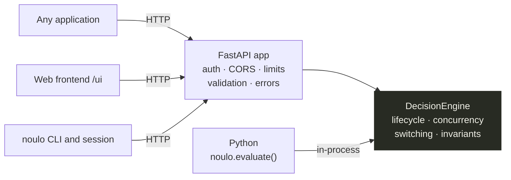
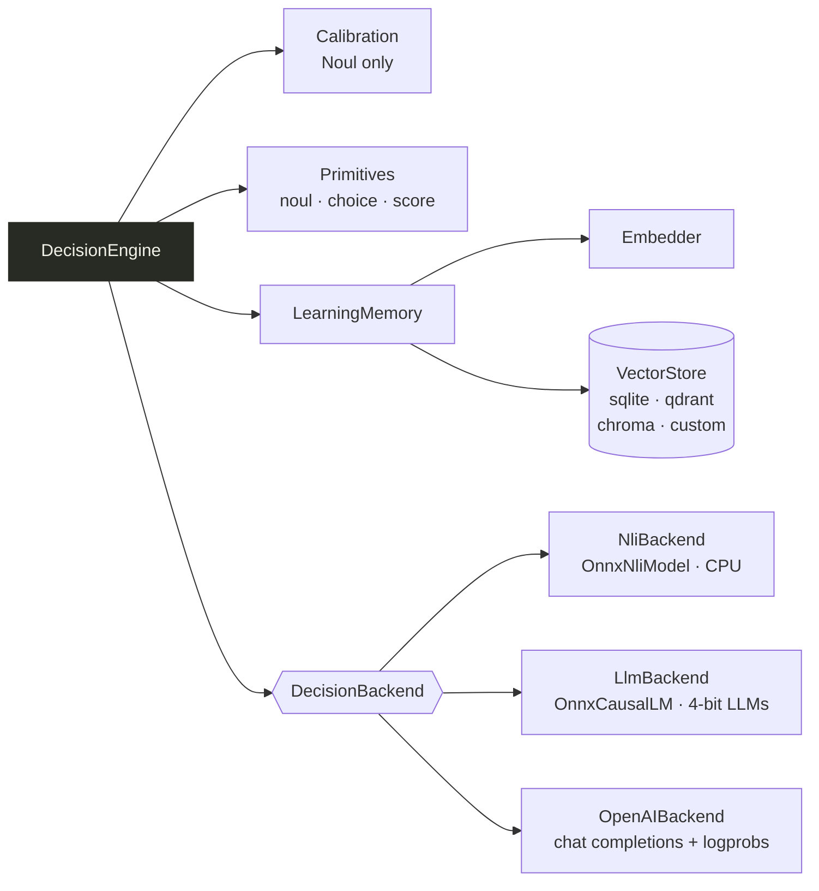
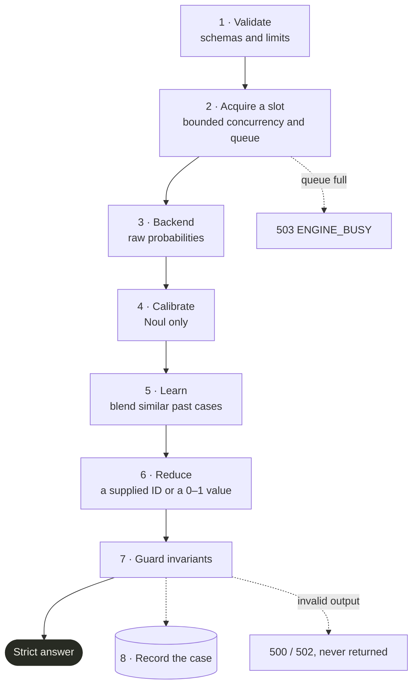
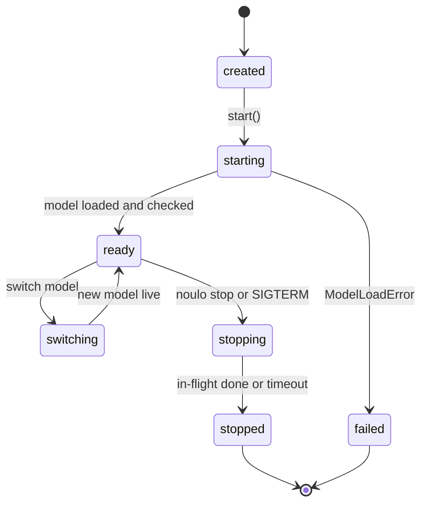
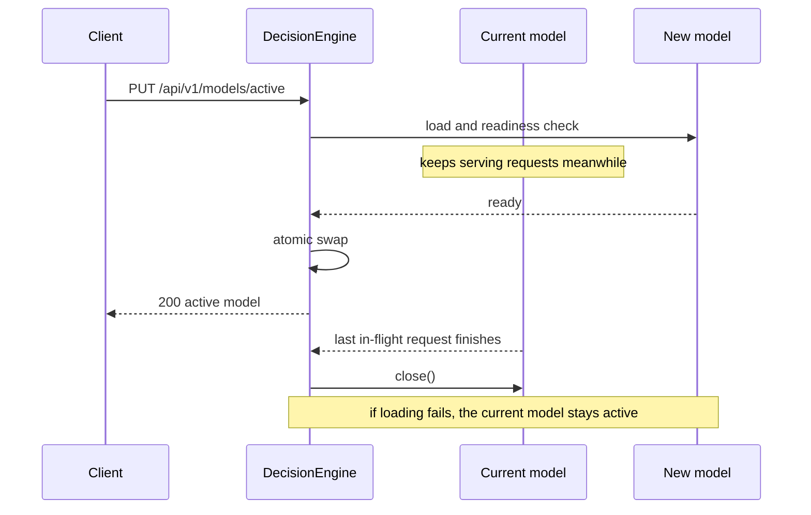

# Architecture

**Ways in.** Every interface ends up in the same engine:

**Inside the engine.** Calibration, the three primitives and the learning memory are shared;
only the decision backend changes with the model:

**One inference implementation.** The REST API, CLI, frontend and Python module all end up
in `DecisionEngine.evaluate()`, and the REST API and Python module share the same request
validation (`api/validation.py`). There is no second code path to drift.

## Request pipeline

1. **Validate** (`parse_request`): Pydantic schemas plus stable, human-readable messages and
   configurable limits. The same schemas generate the OpenAPI document.
2. **Acquire** a slot: bounded concurrency (`NOULO_MAX_CONCURRENCY`) and a bounded queue
   (`NOULO_MAX_QUEUE` → `503 ENGINE_BUSY`). The request also pins the *current* backend, so a
   model switch can't pull it out from under a running request.
3. **Backend** returns raw probabilities: a Noul scalar, or a distribution over options or levels.
4. **Calibrate** (Noul only).
5. **Learn** (optional): recall similar cases for the same task and blend them in.
6. **Reduce** to the primitive: Choice = argmax over the *supplied* IDs (ties go to the first);
   Score = expected level ÷ max level.
7. **Guard invariants:** non-finite or out-of-range values and wrong-length distributions
   raise `InferenceError` (HTTP 500/502). They're never returned.
8. **Record** the case in memory with the pre-blend model outcome. Learning failures are
   logged and never break inference.

## NLI formulation

| Primitive | Premise | Hypothesis | Value |
|---|---|---|---|
| Noul | input | proposition | `P(entail) + 0.5·P(neutral)` (3-class) or `P(entail)` (2-class) |
| Choice | input (or input + question) | template(question, option), per option | softmax over entailment (or entailment − contradiction) logits across options |
| Score | input (or input + question) | template(question, level), per level | same distribution → Σ p·level ÷ (n − 1) |

All candidate hypotheses for a request are scored in **one padded batch**. The template,
premise mode, method and Score temperature are per-model, tuned data (`profile.json`).

## Lifecycle

**Startup** (uvicorn lifespan, before the socket is bound):
1. build the registry and engine from settings
2. load the model once (`ModelLoadError` → the process exits with a clear message)
3. readiness check: one tiny inference must produce finite output
4. load the calibration, and open the learning memory if enabled
5. bind the API; `/health` → `200 ok`
6. `noulo start` opens the frontend

**Shutdown** (SIGTERM / Ctrl+C / `noulo stop`):
1. uvicorn stops accepting connections
2. in-flight requests finish (new engine calls get `503 SHUTTING_DOWN`), up to
   `NOULO_SHUTDOWN_TIMEOUT`
3. the model session and memory store are released
4. the listener closes

**Model switch** (`PUT /api/v1/models/active`): the new model is loaded and warmed up
while the old one keeps serving. The swap is atomic, and the old backend is closed only once
its last in-flight request finishes. If loading fails, the old model stays active.

## Background service

`noulo start` spawns `python -m noulo.cli --env-file <abs .env> serve ...` detached, writes
`data/run/noulo.pid` (pid, host, port, UI mode), and waits for `/health`. `restart` reuses
the recorded address and UI mode. `stop` sends SIGTERM and escalates to SIGKILL only after
the timeout.

## Why these choices

| Decision | Reason |
|---|---|
| Encoder NLI models, not a generative LLM | Deterministic, calibratable probabilities; 80 MB instead of GBs; ~8 ms per call on CPU |
| ONNX Runtime + `tokenizers`, no PyTorch | Keeps a running server at ~300–500 MiB (model-dependent) and installs fast on every OS/arch |
| INT8 dynamic quantisation | Best measured size/speed/accuracy balance (see [model-comparison.md](model-comparison.md)) |
| Calibration as a separate JSON layer | Can be refitted or replaced without touching the model |
| Logprobs for remote LLMs, next-token probabilities for local LLMs | Honours "never ask a generative model for a number" while still supporting them; local LLMs need one forward pass, no generation loop |
| Learning as a probability blend | Works with any backend, is bounded by `max_influence`, can never invent an option |
| Pluggable vector store | SQLite with zero setup; Qdrant/Chroma/custom when you outgrow it |
| Python/FastAPI | Requested by the project owner (the original spec preferred Node.js) |
