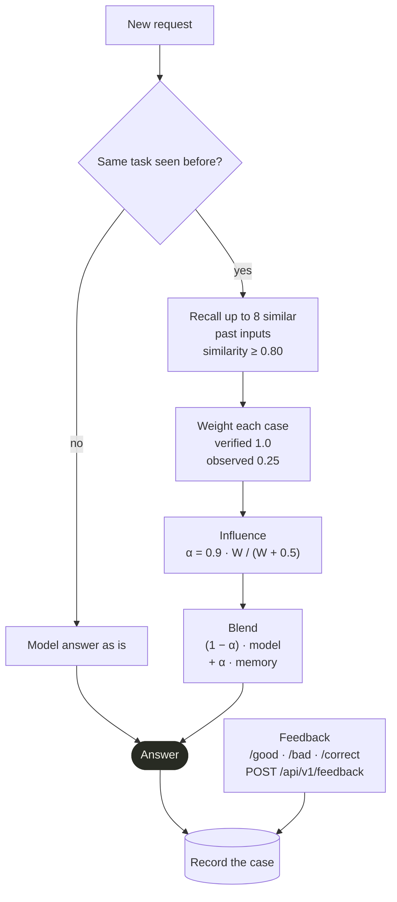

# Learning from inputs

noulo can remember the cases it evaluates, and your corrections, and use them to adjust
future answers for **similar inputs to the same task**. This is retrieval-augmented, like
RAG, but instead of adding text to a prompt it blends the outcomes of retrieved past cases
into the model's probabilities. It works the same for local and remote models.

Learning is **on by default**, and you can switch it at any time:

```bash
noulo learning off                 # live on the running server + saved to .env
noulo learning on
curl -X PUT localhost:8787/api/v1/learning -H 'Content-Type: application/json' -d '{"enabled":false}'
```

When it's off, nothing is recorded, memory isn't consulted, and the embedder isn't even
loaded, which saves RAM.

## What is stored

For each evaluation, noulo stores a **record** in the vector store:

| Field | |
|---|---|
| primitive + **task key** | Which question was asked. Noul: the normalised proposition. Choice: question + sorted `id=text` options. Score: question + ordered rubric |
| input + input embedding | The text and its sentence embedding (`NOULO_EMBEDDER`) |
| observed outcome | The model's answer **before** learning was applied (a probability, a choice id or a score) |
| verified outcome | Set by feedback (the "score on the input" you teach it) |
| hits, model id, timestamps | Repeated identical cases update one record instead of adding duplicates |

Browse it with `noulo learning records`, `GET /api/v1/learning/records`, or the **Memory**
panel in the frontend. Delete everything with `noulo learning clear --yes`.

## How memory changes an answer



For a new request, noulo:

1. **Retrieves** up to `top_k` (8) past records with the same primitive and task key whose
   inputs have cosine similarity of at least `min_similarity` (0.80) to the new input.
2. **Weights** each one: `w = similarity × (feedback_weight if verified else observed_weight)`,
   with defaults `1.0` and `0.25`.
3. **Sets its influence** from the total evidence `W = Σw`:
   `α = max_influence × W / (W + prior_strength)` (defaults `0.9`, `0.5`).
   One exact verified match gives α = 0.6; more agreeing evidence approaches 0.9.
4. **Blends:**
   - Noul / Score: `(1 − α) · model + α · weighted mean of past outcomes`
   - Choice: `(1 − α) · model distribution + α · weighted votes`, counting only votes for
     options **you supplied in this request**, so memory can never invent an option.
5. **Records** the new case with the model's pre-blend output, so memory doesn't feed on itself.

`?diagnostics=true` shows `learning.applied`, `influence` (α) and `matches`.

Example:

```bash
noulo noul -i "My parcel never arrived." -p "The customer is satisfied." --json
# {"type":"noul","value":0.07,"recordId":"4c1e..."}
noulo feedback 4c1e... false          # confirm (or correct) the outcome
```

A correction for an input the model got wrong flips future answers for that case and moves
answers for close paraphrases.

## Feedback

| Primitive | `expected` |
|---|---|
| Noul | `true` / `false`, or a probability `0.0`–`1.0` |
| Choice | one of the option ids of that request |
| Score | a value `0.0`–`1.0`, or (with the full-request form) a rubric level name |

Two ways to send it:

- **By record id** (`X-Record-Id` header, `--json` output, or the frontend's "Was this right?"):
  `POST /api/v1/feedback {"recordId": "...", "expected": false}`
- **By full request** (teach without evaluating first; good for seeding known cases):
  `POST /api/v1/feedback {"request": {"type": "noul", ...}, "expected": 1}`

## Teach from a file

To teach many examples at once, put them in a file: **JSON Lines** (one example per line;
blank lines and `#` comments are skipped), or a JSON array / `{"examples": [...]}`. Each example
is an ordinary `/api/v1/evaluate` request plus the right answer in `expected`:

```jsonc
{"type": "noul", "input": "My parcel never arrived.", "proposition": "The customer is satisfied.", "expected": false}
{"type": "choice", "input": "My app crashes in settings.", "question": "Which department should handle this?",
 "choices": [{"id": "A", "text": "Billing"}, {"id": "B", "text": "Technical Support"}], "expected": "B"}
{"type": "score", "input": "A typo in the wiki footer.", "question": "How severe is this incident?",
 "rubric": ["insignificant", "low", "medium", "high", "critical"], "expected": "insignificant"}
```

(Each example must be on a single line in a `.jsonl` file; they're wrapped above for reading.)

| Primitive | `expected` |
|---|---|
| Noul | `true` / `false`, or a probability `0.0`–`1.0` (`0.5` = the input doesn't say) |
| Choice | one of that example's option IDs |
| Score | a rubric level name, or a value `0.0`–`1.0` |

`type` can be left out when the fields make it obvious. The benchmark dataset format is
accepted too, so `benchmark/data/*.jsonl` can be taught directly: `label` (`yes`/`no`/`unknown`)
for Noul, `answer` for Choice and `expected_level` for Score.

**Teaching only affects the same task:** the same proposition (Noul), the same question and
options (Choice) or the same question and rubric (Score). Within that task, inputs similar to a
taught example lean towards its answer (see [How memory changes an answer](#how-memory-changes-an-answer)).
So teach with the exact questions your application asks.

| Where | How |
|---|---|
| CLI | `noulo teach examples.jsonl` (checks the whole file first; `--dry-run` only checks) |
| Interactive session | `/teach examples.jsonl` |
| Frontend | **Import examples…** in the Memory panel |
| REST API | `POST /api/v1/learning/import` `{"items": [...]}` (up to 1,000 examples per request) |
| Python | `Noulo().teach_file("examples.jsonl")` |

```text
$ noulo teach examples/teaching.jsonl
Taught 7 examples (choice 2, noul 3, score 2).
```

Bad examples don't stop the rest: each one is reported with its line number (for example
`line 4: Noul requires a proposition.`), and the command exits with code 1. Learning must be on
(`noulo learning on`). A ready-made file to try is in
[examples/teaching.jsonl](../examples/teaching.jsonl).

## Tuning the behaviour

| Goal | Setting |
|---|---|
| Only learn from explicit feedback | `NOULO_MEMORY_OBSERVED_WEIGHT=0` |
| Make feedback override the model more strongly | raise `NOULO_MEMORY_MAX_INFLUENCE` (≤ 1) or lower `NOULO_MEMORY_PRIOR_STRENGTH` |
| Only near-identical inputs count | raise `NOULO_MEMORY_MIN_SIMILARITY` (e.g. `0.9`) |
| Paraphrases count more | lower it (e.g. `0.7`); watch for unrelated matches |
| No embedding model | `NOULO_EMBEDDER=hashing` (lexical similarity only) |

## Vector stores: local or remote

The memory logic is separate from storage behind a small `VectorStore` interface. Select the
store with `NOULO_MEMORY_STORE` and `NOULO_MEMORY_LOCATION`:

| Store | Local | Remote | Install |
|---|---|---|---|
| `sqlite` (default) | `data/memory.sqlite3` (WAL; cosine in numpy) | n/a | built in |
| `qdrant` | a directory (embedded mode) or `:memory:` | `http(s)://host:6333` (+ `NOULO_MEMORY_API_KEY`) | `pip install "noulo[qdrant]"` |
| `chroma` | a directory (persistent) or unset (in-memory) | `http(s)://host:8000` | `pip install "noulo[chroma]"` |
| `your.module:YourStore` | anything | anything | your code |

```bash
# Remote Qdrant
noulo config set memory_store qdrant
noulo config set memory_location https://qdrant.internal:6333
noulo config set memory_api_key "$QDRANT_API_KEY"
noulo restart
```

The collection name is `NOULO_MEMORY_COLLECTION` plus the embedder id
(e.g. `noulo_memory_minilm_l6_v2_int8`), so switching embedders never mixes vector widths.

### Bring your own vector database

Implement the protocol in `noulo/inference/stores/__init__.py` and point
`NOULO_MEMORY_STORE` at it:

```python
# my_stores.py
from noulo.inference.stores import MemoryRecord

class PgVectorStore:
    def __init__(self, *, location, collection, api_key=None, dim=None): ...
    def upsert(self, record: MemoryRecord) -> None: ...
    def get(self, record_id: str) -> MemoryRecord | None: ...
    def find_duplicate(self, *, primitive, task, input_norm, model_id) -> MemoryRecord | None: ...
    def search(self, *, primitive, task, embedder_id, vector, top_k, min_similarity
               ) -> list[tuple[MemoryRecord, float]]: ...   # cosine similarity, descending
    def list(self, *, limit, offset, primitive=None) -> list[MemoryRecord]: ...  # newest first
    def count(self) -> dict[str, int]: ...                   # {"records": n, "verified": m}
    def clear(self) -> int: ...
    def close(self) -> None: ...
```

```bash
NOULO_MEMORY_STORE=my_stores:PgVectorStore NOULO_MEMORY_LOCATION=postgresql://... noulo start
```

`tests/test_vector_stores.py` is a contract suite that every store must pass; parametrise it
with your store to check it.

## Privacy

The memory stores input text. It stays on your machine with the local stores, and goes to
your server with remote ones. Turn learning off to stop recording, and clear the memory to
delete what's stored.
