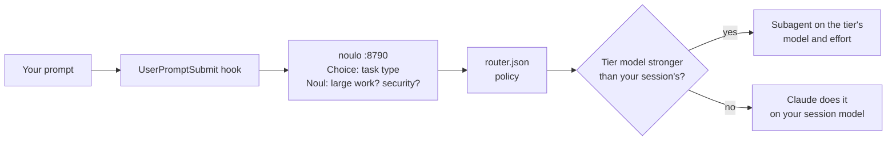

# noulo-router: let noulo pick the Claude model for each prompt

A [Claude Code](https://code.claude.com) plugin, and an example of noulo making a real decision.
Every prompt you type goes to a local noulo instance. noulo decides what kind of task it is. The
plugin maps that answer to a model tier, and Claude hands the work to a subagent on a stronger
model when the task needs one.

```text
❯ test_add_negative fails since yesterday, find out why and fix it
  ⎿  UserPromptSubmit says: noulo-router → deep · opus · high (debug, 64%)
⏺ noulo-router:deep-agent(Debug and fix test_add_negative failure)
  ⎿  Backgrounded agent (↓ to manage · ctrl+o to expand)
⏺ Agent "Debug and fix test_add_negative failure" finished · 31s
⏺ Confirmed — calc.py now has the fix applied. …
```

That's a real Sonnet session (Claude Code v2.1.283): noulo called it a debug task, so Claude
handed the fix to the deep tier's subagent, which ran on Opus.

> [!NOTE]
> This is an alpha example. noulo is a small local model, so it routes about two thirds of
> prompts to the intended tier (see [measured accuracy](#measured-accuracy)). When it gets a
> prompt wrong, Claude usually just does the task on your session model.

## How it works



For each prompt, noulo answers three questions (three calls, about 0.4 s in total):

| Call | Question | Used for |
|---|---|---|
| Choice | What kind of task is this? (explain, edit, chore, feature, debug, refactor, design, review) | The tier |
| Noul | "The request needs substantial work across many files or a deep investigation." | Moves a deep task to max |
| Noul | "The request involves security." | Makes it at least deep |

The policy in [`router.json`](router.json):

| Tier | Task types | Model | Effort | Subagent |
|---|---|---|---|---|
| light | explain, edit, chore | `haiku` | `low` | none, nothing is weaker |
| standard | refactor | `sonnet` | `medium` | `noulo-router:standard-agent` |
| deep | feature, debug, design, review | `opus` | `high` | `noulo-router:deep-agent` |
| max | a deep task where the large-work check is at least 0.5 | `fable` | `xhigh` | `noulo-router:max-agent` |

- A security probability of 0.8 or more makes the tier at least deep.
- If noulo's task type is below 20% probability, the tier is standard.
- Short follow-ups (three words or fewer, like "yes, go ahead") keep the previous tier without
  asking noulo.
- Slash commands, and messages Claude Code generates itself (such as a subagent's completion
  notice), aren't routed.

The tiers use model aliases, so they always run the latest Haiku, Sonnet, Opus and Fable.

### Why subagents?

Before building this, each way of switching models was tested in Claude Code v2.1.283, in
headless and interactive sessions:

| Mechanism | Model changes? | Effort changes? |
|---|---|---|
| A hook's output | No, hooks have no `model` or `effort` output | No |
| Claude invokes a skill with `model:` / `effort:` frontmatter | **No**, the session model keeps answering | **No** |
| You type that skill: `/noulo-router:deep <prompt>` | **Yes**, for that turn | Yes |
| Claude delegates to a subagent with `model:` / `effort:` | **Yes** | **Yes** (Haiku ignores effort) |

So a subagent is the only way to switch models automatically. The subagent works from Claude's
brief: it can read your repository but doesn't see the conversation. Claude delegates only
**up** (for example a Sonnet session sends deep work to Opus). Delegating down would add a
round trip without saving much.

## Install

You need Claude Code v2.1.271 or later, `python3` 3.10 or later on your `PATH`, and a noulo
clone (see the [main README](../../README.md#quick-start)).

**1. Start a noulo instance just for routing.** It has its own port, memory and run directory,
so the prompts it sees stay separate from your other noulo data. From your noulo clone:

```bash
uv run noulo model download zeroshot-deberta-v3-base-fp32     # 739 MB, the most accurate model
NOULO_MODEL=zeroshot-deberta-v3-base-fp32 NOULO_RUN_DIR=data/router \
NOULO_MEMORY_LOCATION=data/router/memory.sqlite3 uv run noulo start --headless --port 8790
```

Stop it with `NOULO_RUN_DIR=data/router uv run noulo stop`. The plugin never starts noulo for
you. If it isn't running, you get a warning when a session starts and your prompts go through
unrouted.

**2. Install the plugin.** From the GitHub marketplace:

```bash
claude plugin marketplace add amzu-dev/noulo
claude plugin install noulo-router@noulo
```

Or load it from your clone for one session: `claude --plugin-dir examples/claude-code-router`.

**3. Run your session on Sonnet** (optional, recommended): `claude --model sonnet`. Everyday
work stays on Sonnet, and deep and max work go to Opus and Fable.

## Use

| Command | What it does |
|---|---|
| (just type) | noulo routes the prompt; the line under it shows the tier, the task type and noulo's confidence |
| `/noulo-router:light` · `standard` · `deep` · `max` `<prompt>` | Runs this one turn on that tier's model and effort, with the whole conversation |
| `/noulo-router:why` | Shows the last decision: tier, task type, the two checks, the prompt |
| `/noulo-router:correct <task type> [large\|small] [security\|no-security]` | Tells noulo the right answer for the last prompt (verified feedback) |
| `/noulo-router:status` · `/noulo-router:status all` | Which Claude models ran, when, and their tokens: this session, or every session in the last 24 hours ([below](#status)) |
| `/noulo-router:disable` · `/noulo-router:enable` | Turn routing off in every session, and back on. `status`, `why` and `correct` keep working while it's off |

`why`, `correct`, `status`, `disable` and `enable` are answered by the plugin's hook before the
prompt reaches Claude, so they cost no tokens. Claude Code shows the answer under
"UserPromptSubmit operation blocked by hook", which is how a hook shows text without calling
Claude. The `/noulo-router:<tier>` commands do go to Claude, because running a turn is their job.

The plugin's options are in `/config`:

| Option | Default | |
|---|---|---|
| `mode` | `auto` | `auto`: Claude delegates to a stronger tier's subagent. `suggest`: only shows the tier and the `/noulo-router:<tier>` command. `off`: no routing |
| `url` | `http://127.0.0.1:8790` | The router's noulo instance |

If you set `NOULO_API_KEY` on the router's instance, export the same value as
`NOULO_ROUTER_API_KEY` before starting Claude Code.

### Status

`/noulo-router:status` reads the session's transcripts at that moment, including every subagent's,
so the numbers are current. The plugin's hook answers it before Claude sees the prompt, so it
makes no model call and costs no tokens. This is from a real Sonnet session:

```text
noulo-router status · this session · updated 14:44:42
noulo    up · zeroshot-deberta-v3-base-fp32 · http://127.0.0.1:8790 · 1 prompt routed · p50 1015 ms

Claude API calls               calls     input  cache write   cache read    output
  sonnet 5.5 · main                3         8       26,485      127,499     1,133
  opus 5.5 · deep-agent            5        10       40,181      148,100       42+
  total                            8        18       66,666      275,599    1,175+
  + 5 calls have no final output count yet, so output is at least this.
    (Still running, or run by a background subagent: Claude Code doesn't record
    a background subagent's final count.)

Prompts, newest first
         14:41  deep · opus · high  (debug 64%)  test_add_negative fails since yesterday, find out why and f…
                → sonnet 5.5 main ×3 · 1,133 out   opus 5.5 deep-agent ×5 · 42+ out
```

- **Claude API calls:** one row per model and where it ran (`main` is your session; the others are
  subagents). `input` is uncached input; `cache write` and `cache read` are prompt-cache tokens.
- **Prompts:** each routed prompt with its tier, then the calls made until your next prompt in
  that session.
- **Accuracy of the numbers:** in a headless session the four token columns matched Claude
  Code's own `modelUsage` exactly, for the Sonnet session and its Opus subagent. When Claude runs a
  subagent in the background, Claude Code records its input and cache counts but not its final
  output count, so that output is shown as a minimum with `+`.

For a view that keeps updating, run this in another terminal. It redraws every 2 seconds:

```bash
python3 examples/claude-code-router/scripts/noulo_router.py status all --watch
```

It finds the plugin's data in `~/.claude/plugins/data/noulo-router-*/` (the most recently used
one, if there are several; `--data` picks one). Add `--hours 168` for a week.

### Teaching it

`/noulo-router:correct` sends verified feedback to noulo's learning memory, which applies to
**similar** prompts. In one test, "The add function in calc.py returns the wrong result when one
number is negative. Find the bug and fix it." was classified as `review` (55%). After
`/noulo-router:correct debug`, the same prompt came back as `debug` (76%), and so did a reworded
version (74%).

To teach many prompts at once, or to check routing on your own prompts, write JSON Lines with
`prompt`, `task`, `complexity` (`trivial` … `very complex`) and `tier`, then:

```bash
python3 examples/claude-code-router/scripts/noulo_router.py teach my-prompts.jsonl
python3 examples/claude-code-router/scripts/noulo_router.py eval  my-held-out-prompts.jsonl
```

Never evaluate on prompts you taught: the result would say nothing about new prompts.

## Measured accuracy

These results come from 40 held-out prompts ([`data/eval.jsonl`](data/eval.jsonl), 5 per task type),
measured with `noulo_router.py eval` on an Apple M1 Pro (macOS 26.5, CPU). The policy and the
option wording were chosen on a separate calibration set ([`data/seed.jsonl`](data/seed.jsonl),
48 prompts), and the held-out prompts were never taught. The expected task type and tier of
every prompt are the author's labels.

| Router model | Task type | Tier | Latency per prompt, p50 / p95 |
|---|---|---|---|
| `zeroshot-deberta-v3-base-fp32` (recommended) | **70.0%** (28/40) | **65.0%** (26/40) | 414 / 514 ms |
| `nli-deberta-v3-xsmall-int8` (noulo's default) | 52.5% (21/40) | 32.5% (13/40) | 146 / 237 ms |

- **Which way the misses go** (base model): 10 of the 14 wrong tiers were lower than intended.
  In `auto` mode Claude then does the task on your session model, the same as without the
  plugin. The other 4 were higher than intended, which costs extra.
- **Teaching the calibration set didn't change these numbers** on either model. noulo's memory
  only affects similar prompts, and none of the held-out prompts paraphrase a taught one.
- **Complexity is hard for these models.** A Score for "how much work does this need" gave the
  same average for trivial and very complex prompts on all three models tried, so the policy
  doesn't use it.
- **Long prompts are slower:** noulo sees only the first 300 and last 150 characters, and a
  long prompt with a pasted traceback took 1.5–2.1 s.
- **The sample is small:** with 40 prompts, one prompt is 2.5 points, so treat the numbers as
  indicative.

In one end-to-end run, fixing a small bug cost $0.32 in a Sonnet session that delegated to Opus
and $0.32 in an Opus session that did it directly. That's a single run, not a benchmark.

## Privacy

- Prompts go only to the noulo instance at `url`, which is on your machine by default.
- The router's noulo stores the prompts it evaluates in its memory
  (`data/router/memory.sqlite3`). Clear it with
  `curl -X DELETE http://127.0.0.1:8790/api/v1/learning/records`. Starting it with
  `NOULO_LEARNING_ENABLED=false` stores nothing, but `/noulo-router:correct` then can't work.
- The plugin keeps the last decision per session in `state.json`, a log of routing decisions
  for `/noulo-router:status` in `events.jsonl`, and a `disabled` file while routing is off. All
  three are in `~/.claude/plugins/data/noulo-router-*/`. The first two include the first 200
  characters of each prompt, and the log keeps its newest 1–2 MB.
- `/noulo-router:status` reads Claude Code's transcripts but only reports models, times and token
  counts from them.

## Tuning

Everything the router asks and decides is in [`router.json`](router.json):
- the Choice question and the task descriptions;
- the two Noul propositions;
- the task → tier table;
- the thresholds: `max_at`, `security_at` and `min_confidence`;
- the follow-up length.

If you change a tier's model or effort, change the matching `agents/<tier>-agent.md` and
`skills/<tier>/SKILL.md` too; the tests check that they agree. Taught examples only apply to
the exact question and options they were taught with, so re-teach after changing the wording.

Run the plugin's tests from the repository root: `uv run pytest tests/test_claude_code_router.py`.

## Files

```
.claude-plugin/plugin.json   manifest and the mode / url options
hooks/hooks.json             SessionStart (health warning); UserPromptSubmit (routing, commands)
scripts/noulo_router.py      the hooks, the commands, teach/eval: standard library only
router.json                  the policy
agents/*-agent.md            delegation targets, one per tier above light
skills/<tier>/               /noulo-router:<tier> <prompt>
skills/{why,correct,status,  /noulo-router:why, :correct, :status, :disable, :enable
       disable,enable}/      (answered by the hook; the skill files put them in the / menu)
data/seed.jsonl              48 labelled calibration prompts (safe to teach)
data/eval.jsonl              40 labelled held-out prompts (never teach these)
```
